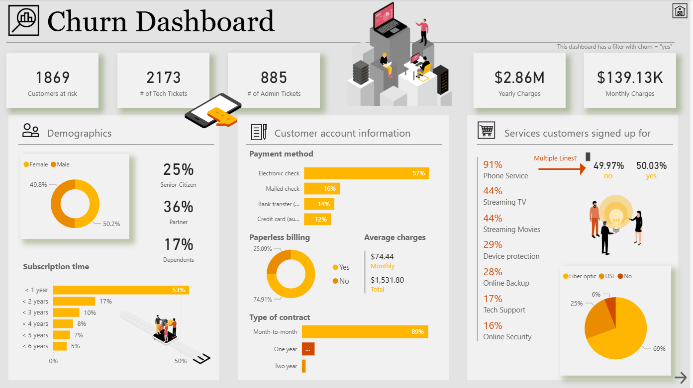

# reports
#### This Power BI report provides a high-level summary of current and historical bid activity, with data ingested directly from a SharePoint list. It gives leadership a clear snapshot of bid types, roles, estimated values, and their current status, supporting better visibility and decision-making around sales and resource allocation. 

#### This churn dashboard provides a comprehensive view of customer churn risk and account characteristics, helping stakeholders identify key drivers behind customer attrition. It focuses exclusively on customers flagged as high-risk (filtered where churn = “yes”) and gives leadership immediate visibility into demographics, service usage, billing behaviours, and account types.
